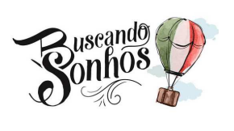

# Buscando Sonhos

A Itália reconhece um cidadão independente da distância da sua descendência, 
meu projeto será baseado na busca de certidões de antepassados italianos, com intuito 
de reconhecimento de cidadania italiana e estudo de genealogia e ancestralidade. 
Existe uma grande dificuldade em encontrar a certidão de nascimento do 
ancestral italiano, principalmente se o requerente está no Brasil ou outros países. 
As vantagens de ter um passaporte italiano são grandes, principalmente pra 
quem quer viver, estudar e/ou trabalhar fora do Brasil.

### Segue abaixo algumas vantagens de ser um cidadão italiano: 
Está entre os passaportes mais poderosos do mundo.

:pushpin: Facilidade de acesso nos Estados Unidos e Canadá.  
:pushpin: Aceito em 189 países, sem burocracia de visto ou exigências.  
:pushpin: Pode trabalhar, morar e/ou estudar legalmente em qualquer país  
da União Europeia.  
:pushpin: Direito a saúde pública e aposentadoria na Itália.

## Como funciona? 
• A alimentação do Banco de dados:  
É feita somente por membros autorizados, após a confirmação de todos os dados  
das certidões e dados reconhecidos legalmente. (informações verdadeiras e 
comprovadas)  
• O requerente não é obrigado a fazer o login para pesquisar se seu sobrenome 
consta em nosso banco de dados.  
• O resultado da pesquisa será:  
:sunglasses: SOBRENOME  
:blush: FONTE  
:house: PROVINCIA  
:house_with_garden: COMUNE  
:baby: DATA DE NASCIMENTO  
:man: PATERNIDADE  
:couplekiss: CONJUGE  
:couple: DATA DE CASAMENTO  
:speedboat: DATA DE CHEGADA AO BRASIL  

• Se caso o sobrenome não for encontrado, será oferecido um link, opcional, um 
formulário, onde o requerente poderá enviar os dados necessários para que 
possamos trabalhar em busca da sua certidão.  
• O procedimento interno para encontrar as certidões é simples, podendo ser feito 
através de e-mails PEC (que só podem ser criados com IP Europeu) a cidade ou 
igreja, informado no e-mail do requerente.  
• Se o requerente, não tem acesso a um e-mail PEC ou fluência em italiano, 
poderá contratar nossos serviços, que por um valor justo, solicitaremos uma 
cópia e enviaremos onde o requerente estiver.  

## Tecnologias utilizadas  
• Node.js  
• MongoDB  
• Git  
##Pacotes utilizados  
• express  
• nodemon  
• dotenv-safe  
• mongoose  
• bcrypt  
• jsonwebtoken  
• validator  
##Instruções de instalação  
# Clonar o repositório  
$ git clone https://github.com/elvirabl/BuscandoSonhos  
# Entrar na pasta do repositório  
$ cd reprograma-projeto-final  
# Instalar as dependências  
$ npm install  
# Executar o servidor  
$ npm start  
## Rotas  
GET - https://buscandosonhos.onrender.com/buscandosonhos/ancestor/all  
GET/ancestral/sobrenome Acessar um registro por sobrenome  
POST - https://buscandosonhos.onrender.com/buscandosonhos/ancestor/add/  
POST - https://buscandosonhos.onrender.com/buscandosonhos/members/add  
PATCH - https://buscandosonhos.onrender.com/buscandosonhos/members/639397fe8165cc4ab5aed39d
PUT/ancestral/idAncestral Alterar dados de um documento 
ancestral  
PUT/membro/idMembro/membro/idmembro Alterar dados de um membro  
DELETE/membro/idmembro Excluir um membro  
DELETE/ancestral/idancestral/ancestrais/idancestral Excluir um documento ancestral  
GET/membros Listar todos os membros  
PATCH/ancestral/idAncestral Alterar status do documento ancestral  
https://https://github.com/elvirabl/BuscandoSonhos  
## Gostaria de contribuir?  
1. Fork o projeto;  
2. Crie uma branch para realizar suas alterações: git checkout -b feature/nomeda-sua-branch  
3. Commit suas alterações e abra um pull request  